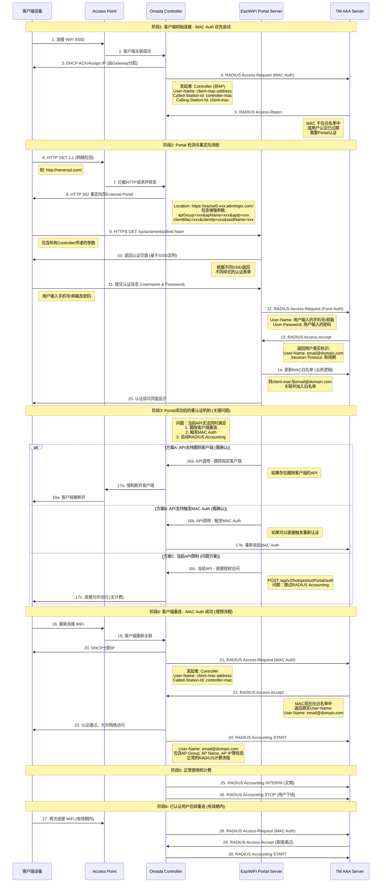

# TM WiFi 项目需求分析报告

## 项目背景

### 客户信息

**TM (Telekom Malaysia)** 是马来西亚最大的电信运营商，提供全国范围的电信基础设施服务。此次项目针对其公共WiFi业务，主要服务场景包括：大学校园网络、政府机构公共WiFi、购物中心等商业场所WiFi

### 合作伙伴架构

**Attrelogix** 作为TM的技术合作伙伴，负责：

- TM后端AAA系统的开发和维护
- Portal服务器的定制开发
- 与Omada系统的集成对接
- 同时也是TP-Link Omada的认证合作伙伴

## 客户Portal服务机制分析

### Portal服务架构设计

Attrelogix为TM设计的Portal服务采用分布式架构：

**EaziWiFi Portal平台**：

- 域名格式：`https://eaziwi5-{location}.attrelogix.com`
- 支持基于地理位置的分布式部署
- 每个location对应不同的服务区域

**认证流程集成**：

> TM AAA Server ←→ Attrelogix Portal ←→ Omada Controller ←→ Access Points
> 

### 业务逻辑设计原理

**为什么采用MAC Auth + Portal Fallback机制？**

1. **用户体验优化**：
    - 已认证用户无需重复输入信息
    - 实现"一次认证，长期使用"的体验
    - 支持跨设备的用户身份管理
2. **运营管理需求**：
    - 精确的用户身份追踪（真实邮箱/手机号）
    - 基于位置的广告投放能力
    - 完整的计费和审计记录
3. **技术架构考虑**：
    - AAA服务器只需维护Controller IP白名单
    - 减少网络复杂度和安全风险
    - 支持大规模AP部署

## 认证方案对比分析

### 单一External Portal方案的问题

- **缺少用户身份持久化**：无法记住已认证用户
- **无RADIUS Accounting**：无法产生标准计费记录
- **重复认证体验差**：用户每次连接都需要重新认证
- **无法支持离线认证**：依赖Portal服务器在线状态

### 单一MAC Auth方案的问题

- **新用户无法注册**：需要预先在AAA服务器配置
- **缺少用户信息收集**：无法获取详细用户资料
- **无个性化服务**：无法基于用户属性提供差异化体验
- **管理复杂度高**：大量MAC地址的维护成本

### 客户当前混合方案的优势

TM选择的MAC Auth + Portal Fallback混合方案解决了上述问题：

**认证流程机制**：

1. **优先MAC认证**：为已注册用户提供无缝体验
2. **智能降级处理**：新用户或过期用户自动进入Portal流程
3. **身份状态同步**：Portal认证成功后更新MAC白名单
4. **统一计费管理**：所有用户最终都通过RADIUS认证产生计费记录

**核心技术特点**：

- **MAC Auth Fallback机制**：MAC认证失败时不断开连接，而是分配受限IP进入Portal流程
- **Controller发起认证**：MAC认证请求由Controller发起，简化AAA服务器的IP白名单管理
- **Portal认证后重连**：Portal认证成功后踢除客户端，重连时通过MAC认证获得完整网络权限
- **用户身份映射**：MAC地址与真实用户身份（邮箱/手机号）的动态关联

## Omada集成方案设计

### 认证配置要求

**SSID配置**：

```json
认证方式: MAC Authentication
MAC Auth Fallback: 启用
Portal类型: External Portal Server
Portal URL: https://eaziwi5-xxx.attrelogix.com/cp/tm-lab/tplink/
```

**RADIUS配置**：

```json
Primary RADIUS Server: TM AAA Server
MAC Auth发起者: Controller (非AP)
Accounting: 启用
```

### 网络权限控制机制

**MAC Auth Fallback状态下的网络权限**：

- 分配受限IP地址（通常为Portal专用网段）
- 允许DNS查询
- 允许访问Portal服务器域名
- 允许访问设备Portal检测域名（captive.apple.com等）
- 阻止其他所有网络访问

**MAC Auth成功后的网络权限**：

- 分配完整IP地址和网络权限
- 开始RADIUS Accounting计费
- 允许正常互联网访问

## 功能需求详述

### 1. MAC认证发起点修改

**当前行为**：MAC认证请求由AP发起
**需求行为**：MAC认证请求由Controller发起

**技术实现**：

- 修改RADIUS Access-Request的发起点
- Called-Station-Id字段设置为Controller MAC
- 支持配置选择（AP模式 vs Controller模式）

**业务价值**：

- AAA服务器只需将Controller IP加入白名单
- 简化大规模部署的网络管理
- 提高安全性和可管理性

### 2. Portal重定向参数增强

**当前参数**：

```
?target=xxx&targetPort=xxx&clientMac=xxx&clientIp=xxx&apMac=xxx
&gatewayMac=xxx&scheme=xxx&ssidName=xxx&vid=xxx&radioId=xxx
&originUrl=xxx&hostname=xxx&serverPort=xxx
```

**新增参数**：

```
&apGroup=xxx        // AP组名称
&apName=xxx         // AP设备名称
&apIp=xxx           // AP设备IP地址
```

**业务价值**：

- 支持基于AP位置的定制化广告推送
- 实现精准的地理位置营销
- 提供个性化的用户体验

### 3. RADIUS计费报文增强

**User-Name字段处理**：

- MAC Auth阶段：初始使用客户端MAC地址
- 认证成功后：使用AAA返回的真实用户标识
- Accounting报文：统一使用真实用户标识

**位置信息字段**：
在RADIUS Accounting报文中添加：

```
AP-Group: xxx
AP-Name: xxx
AP-Location: xxx
```

**技术挑战**：

- 需要Controller记住Portal认证结果
- MAC Auth成功时正确映射用户身份
- 保持Accounting报文的一致性

### 4. Portal认证后处理机制

**当前API限制**：

```
POST /api/v2/hotspot/extPortal/auth
作用：直接授权客户端访问
问题：绕过RADIUS Accounting流程
```

**需求功能**：

- 支持踢除指定客户端的API
- 支持触发MAC重认证的API
- 保持完整的RADIUS认证和计费流程

## 关键报文交互分析

### MAC认证报文结构

**RADIUS Access-Request**：

```
Code: Access-Request (1)
User-Name: "aa:bb:cc:dd:ee:ff"          // 客户端MAC
Called-Station-Id: "11:22:33:44:55:66"  // Controller MAC (关键修改)
Calling-Station-Id: "aa:bb:cc:dd:ee:ff" // 客户端MAC
NAS-IP-Address: Controller_IP
NAS-Port-Type: Wireless-IEEE-802.11
```

**RADIUS Access-Accept** (Portal认证后)：

```
Code: Access-Accept (2)
User-Name: "user@example.com"           // 真实用户标识
Session-Timeout: 3600                   // 有效期
Vendor-Specific Attributes:
  AP-Group: "Campus-North"
  AP-Name: "Building-A-Floor-1"
```

### Portal重定向报文

**HTTP 302 Response**：

```
HTTP/1.1 302 Found
Location: https://eaziwi5-campus.attrelogix.com/cp/tm-lab/tplink/
  ?target=omada.controller.com
  &targetPort=8843
  &clientMac=aa:bb:cc:dd:ee:ff
  &clientIp=192.168.1.100
  &apMac=98:ba:5f:1c:5c:88
  &apGroup=Campus-North              // 新增
  &apName=Building-A-Floor-1         // 新增
  &apIp=192.168.10.50               // 新增
  &ssidName=TM-WiFi
  &scheme=https
  &originUrl=http://captive.apple.com
```

### RADIUS计费报文增强

**Accounting START**：

```
Code: Accounting-Request (4)
Acct-Status-Type: Start (1)
User-Name: "user@example.com"          // 使用真实标识
Acct-Session-Id: "12345678"
Called-Station-Id: "11:22:33:44:55:66" // Controller MAC
Calling-Station-Id: "aa:bb:cc:dd:ee:ff"
Vendor-Specific Attributes:
  AP-Group: "Campus-North"             // 新增
  AP-Name: "Building-A-Floor-1"        // 新增
  AP-IP: "192.168.10.50"              // 新增
```

## 完整认证流程机制

### 混合认证的核心逻辑

**第一步：MAC Auth优先尝试**

- 客户端连接WiFi后，Controller立即向AAA服务器发起MAC认证
- 如果MAC在白名单中且未过期，直接分配IP并开始计费
- 如果MAC不在白名单或已过期，进入Portal Fallback流程

**第二步：Portal Fallback处理**

- 开启MAC Auth Fallback功能，避免直接断开客户端
- 分配受限IP地址，仅允许访问Portal相关域名
- 客户端设备检测到受限网络，自动弹出Portal页面

**第三步：Portal认证流程**

- 用户在Portal页面输入认证信息（手机号/邮箱+密码）
- Portal服务器向AAA服务器验证用户身份
- 认证成功后，AAA服务器更新认证终端MAC的白名单状态

**第四步：重连获得完整权限**

- Portal认证成功后，需要让客户端重新走 MAC 认证，认证权限和计费，方案如下：
    1. 通过API踢除客户端连接，触发客户端自动重连，重走认证流程，会先进行MAC认证，此时MAC已在白名单中，AAA返回真实用户身份，Controller分配完整IP权限并开始RADIUS计费
        
        > 踢除指定客户端的API，如：DELETE /api/v2/clients/{clientMac}/disconnect
        > 
    2. 通过 API 直接发起客户端 Reauth，无须客户端重连，直接触发 Reauth 走 MAC 认证，剩下同上。
        
        > 触发指定客户端重新 Auth，如：POST /api/v2/clients/{clientMac}/reauth
        > 

**第五步：后续无缝重连**

- 用户在有效期内再次连接时，MAC认证直接通过
- 无需重复Portal认证，提供优秀的用户体验
- 保持完整的RADIUS Accounting计费记录

### 技术实现的关键点

**MAC Auth Fallback机制**：

- 这是整个方案的核心技术特性
- 区别于传统的"认证失败即断开"的行为
- 为混合认证方案提供了技术基础

**Controller发起认证**：

- 简化AAA服务器的网络配置
- 统一认证请求的来源，便于管理和审计
- 支持大规模AP部署场景

**用户身份映射**：

- MAC地址与真实用户身份的动态关联
- 支持一个用户多设备的场景管理
- 确保计费记录的准确性和可追溯性

**Portal认证后的状态转换**：

- 从Portal认证状态平滑过渡到MAC认证状态
- 保持用户体验的连续性
- 确保RADIUS计费流程的完整性

